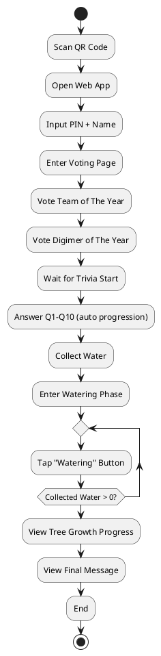
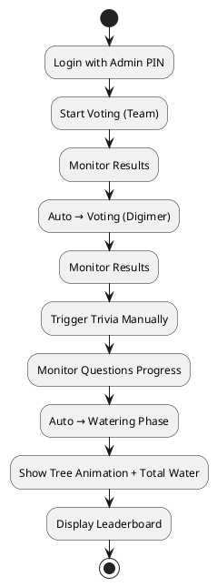

# PRD-1-Voting & Trivia Event System

## Background

Digima ASIA anniversary event includes a Voting session (Team of The Year, Digimer of The Year) and a Trivia Game ("X-Celerate the Tree"). Users join via QR → Web App using a PIN (contains name + division). The system must synchronize all users in real-time, enforce sequential phases (Voting → Trivia → Watering), and support reconnection. The game encodes a philosophy: knowledge (roots) → contribution (water) → collaboration (watering) → growth (tree to 10 stages).

---

## Requirements

### Must Have

- Real-time synchronized phases, timers, and UI for all users
- Single session, admin-controlled phase transitions (manual start for Trivia)
- PIN-based authentication (name + division)
- Voting constraints (cannot vote for own team)
- Large candidate images + names
- Admin views: live voting results, leaderboard, tree animation + total water
- Trivia: 10 questions, 30s each, auto progression
- Water model: +10 collected\_water per correct answer; users convert to contributed\_water during watering
- Watering phase: tap button repeatedly; global progress shared; tree always reaches stage 10
- Reconnection with state recovery
- Consistent UI state across all clients

### Should Have

- Anti-spam for watering clicks (rate limit)
- Admin overrides (skip, next, reset)
- Smooth transitions between phases

### Could Have

- Sound/feedback effects
- Live leaderboard updates

### Won’t Have (MVP)

- Accounts beyond PIN
- Complex analytics dashboard

---

## User Flow

### User Flow



### Admin Flow



---

## Method

### Architecture

```plantuml
@startuml
actor User
actor Admin
User --> Frontend (Next.js)
Admin --> Frontend (Admin View)
Frontend --> WebSocket (Socket.IO)
Frontend --> REST API (HTTP)
WebSocket --> Backend (NestJS)
REST API --> Backend
Backend --> PostgreSQL
Backend --> In-Memory Session State
@enduml
```

### Core Principles

- Server is the source of truth
- Clients render server state
- All timing controlled via server timestamps

### Phase Engine

- Admin manually triggers:
  - Start Voting (Team)
  - Transition auto → Voting (Digimer)
  - Admin manually triggers Trivia
- Trivia auto-loops 10 questions (30s each)
- After Q10 → auto transition to Watering

### Watering Model

- Correct answer → +10 collected\_water
- Click → converts 1 collected\_water → contributed\_water
- Global total\_water increments
- Tree stage: `stage = min(10, floor(total_water / threshold))`
- Passive growth ensures completion

---

## Implementation (Step-by-Step Build Plan)

### Phase 0: Project Setup (Day 1)

1. Initialize repos (Next.js + NestJS)
2. Setup TypeScript
3. Setup PostgreSQL
4. Setup Prisma ORM
5. Configure environment variables

### Phase 1: Database & Models (Day 1–2)

1. Create tables (users, session, candidates, votes, questions, user\_answers, user\_game\_state)
2. Seed candidates + questions
3. Run migrations

### Phase 2: Auth & Session Core (Day 2–3)

1. Implement /auth/join
2. Parse PIN
3. Create/find user
4. Return session state
5. Setup in-memory session

### Phase 3: WebSocket Infrastructure (Day 3–4)

1. Setup Socket.IO
2. Implement events (JOIN, VOTE, ANSWER, WATER)
3. Broadcast SESSION\_STATE

### Phase 4: Voting Module (Day 4–5)

1. Build UI
2. Implement POST /vote
3. Validate rules
4. Live results (admin)

### Phase 5: Trivia Engine (Day 5–6)

1. Implement scheduler
2. Auto question progression
3. Validate answers
4. Add water (+10)

### Phase 6: Watering System (Day 6–7)

1. Build UI (button + progress)
2. Handle clicks
3. Update water values
4. Rate limit
5. Tree stage calculation

### Phase 7: Leaderboard (Day 7)

1. Query top contributors
2. Display admin leaderboard

### Phase 8: Reconnection (Day 7–8)

1. Rehydrate session + user state
2. Ensure idempotency

### Phase 9: Admin Controls (Day 8)

1. Admin UI
2. Manual triggers
3. Monitoring tools

### Phase 10: Testing (Day 9–10)

1. Simulate users
2. Test sync + reconnect
3. Fix edge cases

### Phase 11: Deployment (Day 10)

1. Deploy backend + frontend
2. Configure domain
3. Final QR test

---

## Milestones

- M1: Auth + DB ready
- M2: Real-time sync working
- M3: Voting complete
- M4: Trivia working
- M5: Watering experience complete
- M6: Admin + leaderboard
- M7: Production ready

---

## Success Metrics & Release Criteria

### KPIs

- 100% users successfully join via PIN
- <1 second desync across users (timer accuracy)
-
  > 95% successful answer submissions (no drop)
-
  > 90% users complete full flow (Voting → Watering)
- High engagement:
  - Average clicks per user during watering
- System stability:
  - Zero crashes during event

### Release Criteria

- All Must Have requirements implemented
- No critical bugs in:
  - Voting logic
  - Answer submission
  - Watering system
- Reconnection fully working
- Load tested with 40 concurrent users
- Admin able to control full flow without developer support
- UI consistency across devices (mobile focus)

---